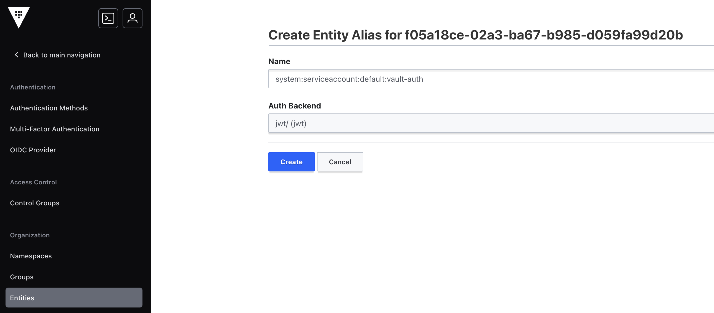
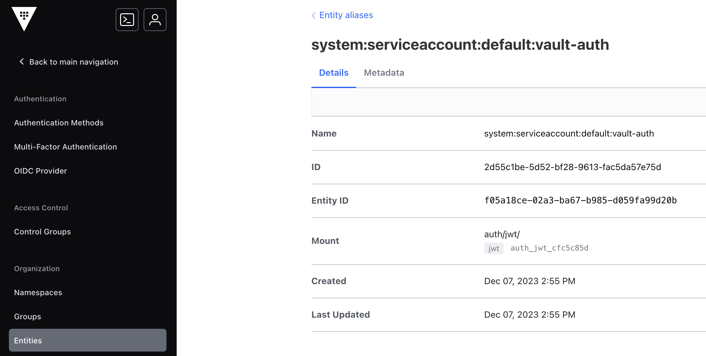

# Vault Auth JWT/OIDC Entity Alias

## Background
[**Entity Aliasing**](https://developer.hashicorp.com/vault/docs/concepts/identity#entities-and-aliases) allows for the same user, application, or workflow utilizing multiple Vault Authentication methods or accounts to be associated with the same [Vault Identity Entity](https://developer.hashicorp.com/vault/docs/concepts/identity#entities-and-aliases).  

The [examples given in this tutorial](https://developer.hashicorp.com/vault/tutorials/auth-methods/identity#create-an-entity-with-alias) consists of a pair of User/Pass Auth Mounts but other Auth Methods are missing.

## Entity Alias Considerations

- **Key Attribute**: To create an Alias for a specific Auth Method, some sort of key identifying attribute must be utilized.
- "**Name**": That above attribute must then have a value defined to map to the "**Name**" input value.

## Auth: Kubernetes JWT/OIDC
- **Key Attribute**: `user_claim`
- **Name**: It depends (see below)

For JWT/OIDC Auth Method (with Kubernetes), the key attribute is [user_claim](https://developer.hashicorp.com/vault/api-docs/auth/jwt#user_claim). [Claims](https://developer.okta.com/blog/2017/07/25/oidc-primer-part-1#whats-a-claim) are:

> name/value pairs that contain information about a user, as well meta-information about the OIDC service. The official definition from the spec is a “[piece of information asserted about an Entity](http://openid.net/specs/openid-connect-core-1_0.html#Terminology).”

This `user_claim` could be any claim `key` with a `value` exchanged in the JWT token. Some examples include:
- `iss`: "[REQUIRED. Issuer Identifier for the Issuer of the response. The `iss` value is a case sensitive URL using the `https` scheme that contains scheme, host, and optionally, port number and path components and no query or fragment components.](https://openid.net/specs/openid-connect-core-1_0.html#IDToken)")
- `sub` "[REQUIRED. Subject Identifier. A locally unique and never reassigned identifier within the Issuer for the End-User, which is intended to be consumed by the Client, e.g., `24400320` or `AItOawmwtWwcT0k51BayewNvutrJUqsvl6qs7A4`. It MUST NOT exceed 255 ASCII characters in length. The `sub` value is a case sensitive string.](https://openid.net/specs/openid-connect-core-1_0.html#IDToken)"

In Vault, the type of `user_claim` is specified in the [Kubernetes JWT Auth `Named Role` Configuration](https://developer.hashicorp.com/vault/docs/auth/jwt/oidc-providers/kubernetes#creating-a-role-and-logging-in) and in keeping with the existing example, the `ID Token Claim` type used will be `sub`.

Example JWT Auth Named Role:
```shell
vault write auth/jwt/role/my-role \
   role_type="jwt" \
   bound_audiences="<AUDIENCE-FROM-PREVIOUS-STEP>" \
   user_claim="sub" \
   bound_subject="system:serviceaccount:default:default" \
   policies="default" \
   ttl="1h"
```

Since the Kubernetes `serviceaccount` JWT is used, the `sub` value needs to be harvested from that JWT token so an Entity Alias can be created prior to that Auth identity requests a token from Vault.

Please refer to the [~/README.md](README.md) in this Repo or this [document](https://developer.hashicorp.com/vault/docs/auth/jwt/oidc-providers/kubernetes) for more Vault Kubernetes JWT/OIDC Auth information.

Steps:
- Harvest Service Account JWT Token
  ```shell
  kubectl get secret {{SERVICE ACCOUNT TOKEN SECRET}} -o json | jq -r .data.token | base64 -d

  LoremipsumdolorsitametconsecteturadipiscingelitseddoeiusmodtemporincididuntutlaboreetdoloremagnaaliquaSuspendissesednisilacussedviverraAdiammaecenassedenimutsemOdioutenimblanditvolutpatmaecenasvolutpatblanditaliquametiamUltricesduisapienegetmiproinsedliberoenimsedNuncnonblanditmassaenimnecduinuncMattisaliquamfaucibuspurusinmassatemporIpsumdolorsitametconsecteturadipiscingelitduistristiqueInaliquamsemfringillautmorbitinciduntaugueinterdumvelitInantemetusdictumattemporcommodoullamcorperAeneansedadipiscingdiamdonecadipiscingtristiquerisusnecUtdiamquamnullaporttitormassaidnequeEgetduisattellusaturnaSedelementumtempusegestassedsedrisuspretiumEgetduisattellusaturnacondimentummattisAteratpellentesqueadipiscingcommodoelitatimperdietduiaccumsanEtmagnisdisparturientmontesnasceturridiculusmusmaurisSedlectusvestibulummattisullamcorpervelitsedullamcorperPurussemperegetduisattellusaturnacondimentummattisV
  ```
- Extract `sub` Value from JWT Token (via https://jwt.io/ or some other JWT decoder)
  ```shell
  jwt-decode LoremipsumdolorsitametconsecteturadipiscingelitseddoeiusmodtemporincididuntutlaboreetdoloremagnaaliquaSuspendissesednisilacussedviverraAdiammaecenassedenimutsemOdioutenimblanditvolutpatmaecenasvolutpatblanditaliquametiamUltricesduisapienegetmiproinsedliberoenimsedNuncnonblanditmassaenimnecduinuncMattisaliquamfaucibuspurusinmassatemporIpsumdolorsitametconsecteturadipiscingelitduistristiqueInaliquamsemfringillautmorbitinciduntaugueinterdumvelitInantemetusdictumattemporcommodoullamcorperAeneansedadipiscingdiamdonecadipiscingtristiquerisusnecUtdiamquamnullaporttitormassaidnequeEgetduisattellusaturnaSedelementumtempusegestassedsedrisuspretiumEgetduisattellusaturnacondimentummattisAteratpellentesqueadipiscingcommodoelitatimperdietduiaccumsanEtmagnisdisparturientmontesnasceturridiculusmusmaurisSedlectusvestibulummattisullamcorpervelitsedullamcorperPurussemperegetduisattellusaturnacondimentummattisV

  [
    {
      "alg": "RS256",
      "kid": "637LmUMJAnG2XzmjbVrJ0PCWw45pgXvKp-sJOD3LlAY"
    },
    {
      "iss": "kubernetes/serviceaccount",
      "kubernetes.io/serviceaccount/namespace": "default",
      "kubernetes.io/serviceaccount/secret.name": "vault-auth-token",
      "kubernetes.io/serviceaccount/service-account.name": "vault-auth",
      "kubernetes.io/serviceaccount/service-account.uid": "83a354d7-4155-4e47-baa5-a931496a96ca",
      "sub": "system:serviceaccount:default:vault-auth"
    }
  ]
  ```
- We see the `sub` or Subject Identifier is `system:serviceaccount:default:vault-auth` so we will utilize this in our Alias for this Auth Method
- In the GUI (Vault `cli` or API methods are also valid), the Entity Alias addition would require the above `sub` value to be input into the `Name` portion for the JWT Auth method.

[](assets/vault-kubernetes-auth_jwt_alias.01.20231207.png)

[](assets/vault-kubernetes-auth_jwt_alias.02.20231207.png)
